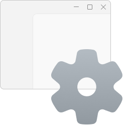
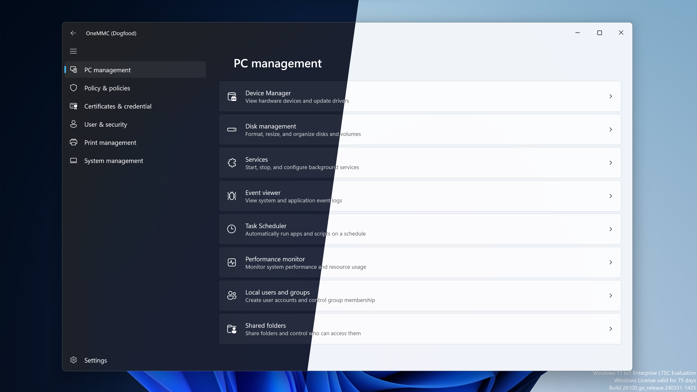
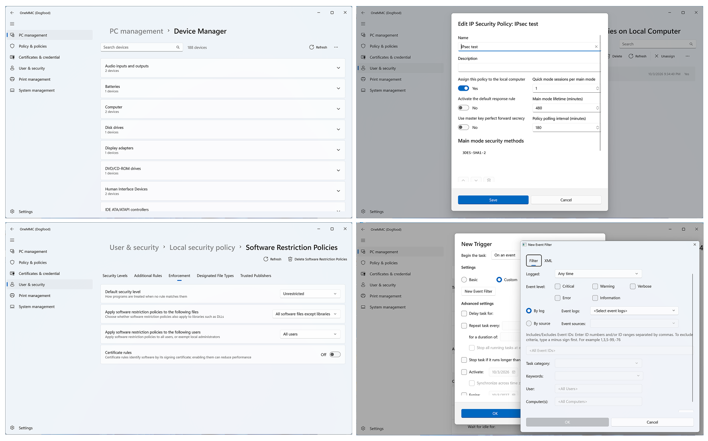

<div style="display: flex; align-items: center; justify-content: left;">
  <picture>
    
  </picture>
  <h1 style="margin-left: 16px;">
    <span>OneMMC</span>
  </h1>
</div>

A modern Windows system management suite built with WinUI 3, designed as a streamlined and contemporary alternative to the legacy Microsoft Management Console (MMC)

> [!WARNING]
> This App is currently in an early dogfooding stage and remains under active development
>
> Parts of the codebase are incomplete and may directly modify critical system components, including disks, services, users, and group policies
>
> Use only in isolated test environments or virtual machines

> [!IMPORTANT]
> **AI-Assisted Development Disclaimer**
>
> This project is developed with AI assistance and manually debugged/reviewed by the author
>
> The codebase may still contain bugs, logic errors, security issues, or design decisions. Structural improvements and refactoring are ongoing
>
> Please test the software in **isolated environment** before using it on production
>
> Use this software **at your own risk**. The author accepts **no liability** for any damage or data loss resulting from its use

<picture>
  
</picture>

## ✨ Features

- Built with WinUI 3, featuring native Dark Mode support, high-DPI awareness, smooth motions, and modern Fluent Design UI/UX behaviors
- Designed following the [Windows 11 design principles](https://learn.microsoft.com/en-us/windows/apps/design/design-principles), with improved visual hierarchy, simplified workflows, and optimized touch/tablet experience
- Consolidates commonly used administrative tools (Services, Device Manager, Event Viewer, Disk Management, Local Users and Groups, and more) into a unified experience
- Built with **100% native Win32 APIs, COM, WMI, and CIM** for maximum performance and direct windows integration



## 🚀 Native AOT

OneMMC compiles as a single native executable with instant startup and a smaller size than ReadyToRun. The entire codebase is strictly optimized for Native AOT, eliminating runtime reflection and trimming issues

---

## 🛠️ Development Guide

### Prerequisites

- Windows 10 May 2020 Update (version 2004, 10.0.19041.0) or newer
- Visual Studio 2026 (or newer) with the following workloads:
    - Desktop development with C++
    - WinUI application development
    - .NET desktop development
- [.NET 10 Runtime](https://dotnet.microsoft.com/en-us/download/dotnet/10.0)
- [Windows App SDK Runtime](https://learn.microsoft.com/en-us/windows/apps/windows-app-sdk/downloads)

### Debugging

#### Clone the Repository
```bash
git clone https://github.com/LuicdLabs/OneMMC
```

#### Open in Visual Studio
- Navigate to **File → Open → Project/Solution**
- Select the `OneMMC.slnx` solution file

#### Set Startup Project
- Right‑click the solution in **Solution Explorer** → **Configure Startup Projects...**
- Under **Configure Startup Projects**, select **Single startup project:**
- From the dropdown, choose **OneMMC**
- Click **OK**

#### Switch to Unpackaged
- In Toolbar, find the dropdown that says **OneMMC (Package)** and change it to **OneMMC (Unpackaged)**
- Navigate to **Debug → Start Debugging** to build and run the application
