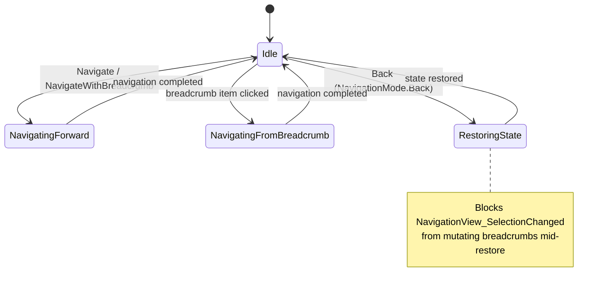
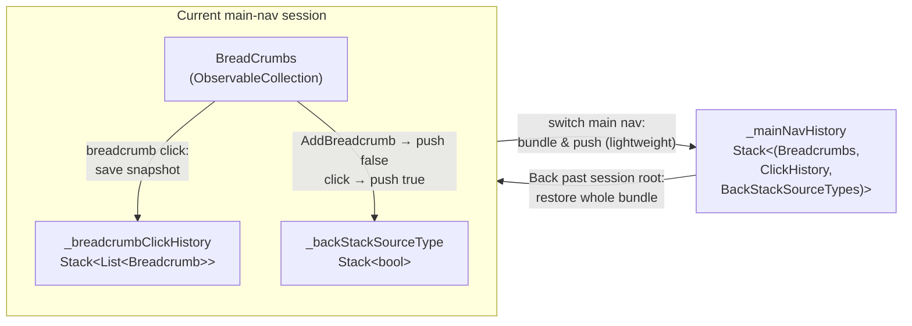
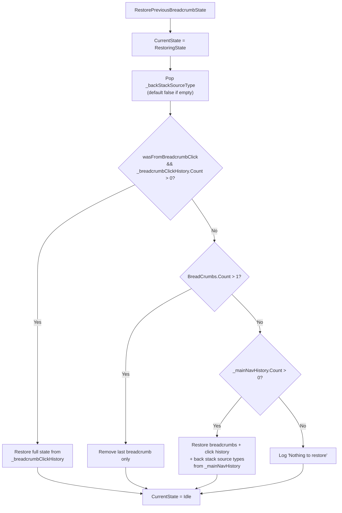

# Breadcrumb Navigation

## Overview

Breadcrumb Navigation is a key navigation feature in the OneMMC WinUI 3 application. It provides a hierarchical navigation path display and quick-jump capability. This feature allows users to clearly understand their current location and easily return to any level in the navigation path.

## Architecture and Components

### Core Components

1. **BreadcrumbNavigationService** - The core service class responsible for managing breadcrumb state and navigation logic.
2. **BreadcrumbBar** - The WinUI 3 UI control used to display breadcrumb items.
3. **MainWindow** - The main window that integrates the breadcrumb bar and navigation frame.

### Dependencies

- **Microsoft.UI.Xaml.Controls.BreadcrumbBar** - WinUI 3 breadcrumb bar control.
- **Microsoft.UI.Xaml.Navigation** - Navigation framework and events.
- **System.Collections.ObjectModel** - Observable collections for data binding.

## Core Classes and Methods

### BreadcrumbNavigationService Class

#### Properties

```csharp
public static NavigationView? MainNavigation { get; private set; }
public static BreadcrumbBar? MainBreadcrumb { get; private set; }
public static Frame? MainFrame { get; private set; }
public static ObservableCollection<Breadcrumb> BreadCrumbs { get; private set; }

// Breadcrumb click navigation history stack (used for going back within the same main navigation session)
private static Stack<List<Breadcrumb>> _breadcrumbClickHistory = new Stack<List<Breadcrumb>>();

// Main navigation history stack (used for going back when switching main navigation items)
// Each item contains: (breadcrumb list, associated click history, associated back stack source type stack)
private static Stack<(List<Breadcrumb> Breadcrumbs, Stack<List<Breadcrumb>> ClickHistory, Stack<bool> BackStackSourceTypes)> _mainNavHistory = 
    new Stack<(List<Breadcrumb>, Stack<List<Breadcrumb>>, Stack<bool>)>();

// Tracks whether each BackStack item was created by a breadcrumb click or normal forward navigation
// True = breadcrumb click navigation (restore from _breadcrumbClickHistory)
// False = normal forward navigation (only remove the last breadcrumb)
private static Stack<bool> _backStackSourceType = new Stack<bool>();

// Current state of the navigation state machine
public static NavigationState CurrentState { get; private set; } = NavigationState.Idle;

// Convenience properties for backward compatibility
public static bool IsNavigatingFromBreadcrumb => CurrentState == NavigationState.NavigatingFromBreadcrumb;
public static bool IsRestoringBreadcrumbState => CurrentState == NavigationState.RestoringState;
```

#### Key Methods

##### Initialization

```csharp
public static void Init(NavigationView navigationView, BreadcrumbBar breadcrumbBar, Frame frame)
```

Initializes the service and stores references to the UI controls in static properties.

##### Navigation Method

```csharp
public static void Navigate(Type targetPageType, NavigateAnimationType animType, object? parameter = null)
```

The primary navigation method. It handles page navigation, breadcrumb management, and animated transitions.

##### Breadcrumb Click Navigation

```csharp
public static void NavigateFromBreadcrumb(Type targetPageType, int breadcrumbIndex, object? parameter = null)
```

Handles navigation when the user clicks a breadcrumb item. It saves the current state to the click history stack and truncates the breadcrumb list. If the page requires a parameter for initialization, pass `parameter` to ensure the page can still load data when returning via a breadcrumb click.

##### Navigation with Breadcrumb

```csharp
public static void NavigateWithBreadcrumb(Type targetPageType, string pageTitle, NavigateAnimationType animType, bool clearNavigation = false, object? parameter = null)
```

Directly adds a breadcrumb item and navigates to the specified page.

##### Breadcrumb Operations

```csharp
public static void AddBreadcrumb(string label, Type pageType, object? parameter = null)
public static void ClearBreadcrumbs()
public static void ChangeBreadcrumbVisibility(bool isVisible)
```

##### History Stack Management

```csharp
private static void SaveToMainNavHistory()
private static void SaveToBreadcrumbClickHistory()
public static void RestorePreviousBreadcrumbState()
public static void ClearHistory()
```

##### Private Helper Methods

```csharp
// Returns page metadata. Attached properties are not read at runtime, so this
// returns constant defaults (true, string.Empty, true). It intentionally does
// NOT instantiate the page (Activator.CreateInstance was removed to avoid leaks).
private static (bool IsHeaderVisible, string PageTitle, bool ClearNavigation) GetPageMetadata(Type pageType)

// Clears navigation session data (breadcrumbs, click history, back stack source types)
private static void ClearNavigationSession()

// Restores breadcrumbs from a list
private static void RestoreBreadcrumbs(IEnumerable<Breadcrumb> breadcrumbs)

// Produces a lightweight copy of a breadcrumb list, dropping Parameter values so
// old view models and large model graphs are not retained by the history stacks
private static List<Breadcrumb> ToLightweightBreadcrumbs(IEnumerable<Breadcrumb> breadcrumbs)

// Deep-copies a breadcrumb click-history stack using lightweight (parameter-less) breadcrumbs
private static Stack<List<Breadcrumb>> CloneLightweightBreadcrumbStack(Stack<List<Breadcrumb>> source)

// Deep-copies a bool stack (back stack source types)
private static Stack<bool> CloneBoolStack(Stack<bool> source)

// Gets navigation transition animation information
private static NavigationTransitionInfo GetTransitionInfo(NavigateAnimationType animType, bool navigatingBack = false)
```

### NavigationState Enum

```csharp
public enum NavigationState
{
    Idle,
    NavigatingFromBreadcrumb,
    RestoringState,
    NavigatingForward
}
```

State definitions for the navigation state machine. These are used to track the current navigation operation type:

- **Idle**: Idle state; no navigation operation is in progress.
- **NavigatingFromBreadcrumb**: A breadcrumb click navigation is being handled.
- **RestoringState**: A previous breadcrumb state is being restored during back navigation.
- **NavigatingForward**: Forward navigation is being performed.

Every navigation operation transitions out of `Idle`, does its work, and returns to `Idle` when the
operation completes. `NavigationView_SelectionChanged` inspects `CurrentState` and skips breadcrumb
mutation while any non-`Idle` operation is in progress:



### Breadcrumb Record

```csharp
// Declared at namespace level (OneMMC.Services) so XAML compiled bindings
// (x:DataType / x:Bind) can reference it.
public partial record Breadcrumb(string Label, Type Page, object? Parameter = null)
{
    public override string ToString() => Label;
}
```

Uses a C# `record` type to store the breadcrumb item's label, page type, and optional navigation parameter. `Parameter` is passed back to the target page during breadcrumb click navigation. Note that the history stacks store *lightweight* copies with `Parameter` set to `null` (via `ToLightweightBreadcrumbs`) so retained history does not keep view models or large model graphs alive.

## Navigation Logic

### Three-Stack History System

This implementation uses three separate history stacks to handle different navigation types:

1. **_breadcrumbClickHistory** - Stores breadcrumb click history within the same main navigation session.
2. **_mainNavHistory** - Stores the full state when switching main navigation items, including breadcrumbs, the associated click history, and back stack source types.
3. **_backStackSourceType** - Tracks the source type of each BackStack item: breadcrumb click or normal forward navigation.



This design ensures that:

- After clicking a breadcrumb within the same main navigation section, pressing Back correctly restores the previous breadcrumb state.
- After normal forward navigation, pressing Back only removes the last breadcrumb instead of incorrectly restoring from the click history.
- After switching main navigation items, pressing Back correctly restores the full state of the previous main navigation section.
- Click history is bound to its owning main navigation session and does not get mixed across sessions.

### Forward Navigation Flow

1. **Check the ClearNavigation property**: Read from the target page's attached property to determine whether the navigation stack should be cleared.
2. **Save the current state**: If clearing is required, call `SaveToMainNavHistory()` to save the current breadcrumbs, click history, and back stack source types to the main navigation history stack.
3. **Clear state**: Clear the breadcrumb collection, click history, back stack source types, and the frame's back stack.
4. **Mark the source type**: When `AddBreadcrumb()` is called, it pushes `false` into `_backStackSourceType`, marking this BackStack item as normal forward navigation.
5. **Add a new breadcrumb**: Add a new breadcrumb item from the page's `PageTitle` attached property.
6. **Update the UI**: Call `UpdateBreadcrumb()` to update the breadcrumb bar display.
7. **Execute navigation**: Navigate to the target page using the specified animation type.

### Back Navigation Flow

The `RestorePreviousBreadcrumbState()` method restores state using the following logic:

1. **Check the back stack source type**: Pop from `_backStackSourceType` to determine what kind of navigation created this BackStack item.
2. **If it was breadcrumb click navigation** (`wasFromBreadcrumbClick == true`): Restore the full breadcrumb state from `_breadcrumbClickHistory`.
3. **If it was normal forward navigation and the breadcrumb count is greater than 1**: Only remove the last breadcrumb item.
4. **If breadcrumbs are exhausted but main navigation history exists**: Restore the full state from `_mainNavHistory`, including breadcrumbs, click history, and back stack source types.
5. **No-op**: If none of the above applies, write a log entry and exit.



```csharp
public static void RestorePreviousBreadcrumbState()
{
    // Set the state to prevent NavigationView_SelectionChanged from modifying breadcrumbs
    CurrentState = NavigationState.RestoringState;
    
    LogDebug("RestorePreviousBreadcrumbState", "START");
    
    // Check the back stack source type
    bool wasFromBreadcrumbClick = false;
    if (_backStackSourceType.Count > 0)
    {
        wasFromBreadcrumbClick = _backStackSourceType.Pop();
    }
    
    if (wasFromBreadcrumbClick && _breadcrumbClickHistory.Count > 0)
    {
        // Restore from click history (Back after breadcrumb click navigation)
        var previousState = _breadcrumbClickHistory.Pop();
        LogDebug("RestorePreviousBreadcrumbState", $"Restoring from click history: [{string.Join(" > ", previousState.Select(b => b.Label))}]");
        RestoreBreadcrumbs(previousState);
    }
    else if (BreadCrumbs.Count > 1)
    {
        // Normal back: remove the last breadcrumb
        LogDebug("RestorePreviousBreadcrumbState", "Removing last item");
        BreadCrumbs.RemoveAt(BreadCrumbs.Count - 1);
        UpdateBreadcrumb();
    }
    else if (_mainNavHistory.Count > 0)
    {
        // Restore from main navigation history (back to the previous main navigation session)
        var (previousBreadcrumbs, previousClickHistory, previousBackStackSourceTypes) = _mainNavHistory.Pop();
        LogDebug("RestorePreviousBreadcrumbState", $"Restoring from main nav history: [{string.Join(" > ", previousBreadcrumbs.Select(b => b.Label))}]");
        
        RestoreBreadcrumbs(previousBreadcrumbs);
        _breadcrumbClickHistory = previousClickHistory;
        _backStackSourceType = previousBackStackSourceTypes;
    }
    else
    {
        LogDebug("RestorePreviousBreadcrumbState", "Nothing to restore");
    }
    
    LogDebug("RestorePreviousBreadcrumbState", "END");
    
    // Reset the state after navigation completes
    CurrentState = NavigationState.Idle;
}
```

### Breadcrumb Click Navigation

1. **Event handling**: Handle clicks in the `MainBreadcrumb_ItemClicked` event.
2. **Validate the index**: Ensure the clicked item is not the last item, which represents the current page.
3. **Set the state**: Set `CurrentState = NavigationState.NavigatingFromBreadcrumb` to prevent other handlers from interfering.
4. **Save the current state**: Call `SaveToBreadcrumbClickHistory()` to save the full breadcrumb state.
5. **Mark the source type**: Push `true` into `_backStackSourceType`, marking this BackStack item as breadcrumb click navigation.
6. **Truncate breadcrumbs**: Remove all breadcrumb items after the clicked item.
7. **Execute navigation**: Navigate to the target page using a slide-from-left animation.
8. **Reset the state**: Set `CurrentState = NavigationState.Idle`.

```csharp
public static void NavigateFromBreadcrumb(Type targetPageType, int breadcrumbIndex, object? parameter = null)
{
    if (MainFrame == null) return;

    // Set the state to prevent NavigationView_SelectionChanged from modifying breadcrumbs
    CurrentState = NavigationState.NavigatingFromBreadcrumb;
    
    LogDebug("NavigateFromBreadcrumb", $"START - targetPage={targetPageType.Name}, index={breadcrumbIndex}");

    // Get page metadata (returns constant defaults)
    var (isHeaderVisible, _, _) = GetPageMetadata(targetPageType);

    // Update title visibility
    if (MainNavigation != null)
    {
        MainNavigation.AlwaysShowHeader = isHeaderVisible;
    }
    ChangeBreadcrumbVisibility(isHeaderVisible);

    // Save the current breadcrumb state to click history for GoBack restoration
    if (breadcrumbIndex < BreadCrumbs.Count - 1)
    {
        LogDebug("NavigateFromBreadcrumb", "Saving state before truncating");
        SaveToBreadcrumbClickHistory();
        
        // Mark this BackStack item as breadcrumb click navigation
        _backStackSourceType.Push(true);
        
        int itemsToRemove = BreadCrumbs.Count - breadcrumbIndex - 1;
        for (int i = 0; i < itemsToRemove; i++)
        {
            BreadCrumbs.RemoveAt(BreadCrumbs.Count - 1);
        }
        UpdateBreadcrumb();
        LogDebug("NavigateFromBreadcrumb", $"After truncating to index {breadcrumbIndex}");
    }

    // Use a slide-from-left animation
    var info = new SlideNavigationTransitionInfo() { Effect = SlideNavigationTransitionEffect.FromLeft };
    
    // Navigate to the target page. This adds the current page to BackStack and enables GoBack.
    MainFrame.Navigate(targetPageType, parameter, info);
    
    // Reset the state after navigation completes
    CurrentState = NavigationState.Idle;
    LogDebug("NavigateFromBreadcrumb", "END - Navigation completed");
}
```

### Manually Adding Breadcrumbs

When breadcrumbs are added through `AddBreadcrumb()`, the navigation is automatically marked as normal forward navigation:

```csharp
public static void AddBreadcrumb(string label, Type pageType, object? parameter = null)
{
    // Mark this upcoming BackStack item as normal forward navigation (not a breadcrumb click)
    // This method is called before contentFrame.Navigate(), which adds the entry to BackStack
    _backStackSourceType.Push(false);
    
    BreadCrumbs.Add(new Breadcrumb(label, pageType, parameter));
    UpdateBreadcrumb();
}
```

### Main Navigation Switching

When the user clicks a main navigation item, such as switching from "User & Security" to "Settings":

1. **Call ClearBreadcrumbs()**:
   - Save the current breadcrumbs, click history, and back stack source types to `_mainNavHistory`.
   - Clear `_breadcrumbClickHistory`, because it has already been saved.
   - Clear `_backStackSourceType`, because it has already been saved.
   - Clear `BreadCrumbs`.

2. **Add a new breadcrumb**: Add a breadcrumb for the new main navigation page.

```csharp
public static void ClearBreadcrumbs()
{
    SaveToMainNavHistory();
    BreadCrumbs.Clear();
    UpdateBreadcrumb();
}

private static void SaveToMainNavHistory()
{
    if (BreadCrumbs.Count == 0) return;

    // Lightweight copies drop Parameter values so old view models and large model
    // graphs are not retained by the history stacks.
    var currentState = ToLightweightBreadcrumbs(BreadCrumbs);
    var clickHistoryCopy = CloneLightweightBreadcrumbStack(_breadcrumbClickHistory);
    var backStackSourceTypeCopy = CloneBoolStack(_backStackSourceType);

    _mainNavHistory.Push((currentState, clickHistoryCopy, backStackSourceTypeCopy));

    // Clear click history and back stack source types; they have already been saved to main navigation history
    _breadcrumbClickHistory.Clear();
    _backStackSourceType.Clear();
}
```

## Navigation Scenario Examples

### Scenario 1: Basic Forward and Back Navigation

```text
Operation: PC Management → Device Manager → Disk Management → Back
State changes:
1. [PC Management] | _backStackSourceType=[]
2. [PC Management > Device Manager] | _backStackSourceType=[false]
3. [PC Management > Device Manager > Disk Management] | _backStackSourceType=[false, false]
4. Back → pop false → not a breadcrumb click → remove the last item
5. [PC Management > Device Manager] | _backStackSourceType=[false]
```

### Scenario 2: Breadcrumb Click Navigation

```text
Operation: User & Security > Auth Manager > Store > App → click "Auth Manager" → Back
State changes:
1. [User & Security > Auth Manager > Store > App] | _backStackSourceType=[false, false, false]
2. Click "Auth Manager" → save the full state to clickHistory, push true into _backStackSourceType
3. [User & Security > Auth Manager] | _backStackSourceType=[false, false, false, true]
4. Back → pop true → breadcrumb click → restore from clickHistory
5. [User & Security > Auth Manager > Store > App] | _backStackSourceType=[false, false, false]
```

### Scenario 3: Back Navigation Across Main Navigation Sections

```text
Operation: User & Security > Auth Manager → click "User & Security" → switch to Settings → Back → Back
State changes:
1. [User & Security > Auth Manager] | _backStackSourceType=[false]
2. Click "User & Security" → clickHistory=[original full path], push true, crumbs=[User & Security]
3. _backStackSourceType=[false, true]
4. Switch to Settings → mainNavHistory saves ([User & Security], clickHistory, _backStackSourceType)
5. [Settings] | _backStackSourceType=[false] (newly added)
6. Back → restore from mainNavHistory
7. [User & Security], while also restoring clickHistory and _backStackSourceType=[false, true]
8. Back → pop true → restore from clickHistory
9. [User & Security > Auth Manager] | _backStackSourceType=[false]
```

## UI Integration

### XAML Definition

```xml
<BreadcrumbBar
    x:Name="MainBreadcrumb"
    FontSize="26"
    FontWeight="SemiBold"
    ItemClicked="MainBreadcrumb_ItemClicked"
    MaxWidth="1000"
    HorizontalAlignment="Stretch">
    <BreadcrumbBar.Resources>
        <Style x:Key="BreadcrumbBarItemStyle" TargetType="BreadcrumbBarItem">
            <Setter Property="FontSize" Value="26" />
            <Setter Property="FontWeight" Value="SemiBold" />
            <Setter Property="Foreground" Value="{ThemeResource TextFillColorTertiaryBrush}" />
        </Style>
    </BreadcrumbBar.Resources>
    <BreadcrumbBar.ItemTemplate>
        <DataTemplate x:Name="BreadcrumbBarItemTemplate" x:DataType="BreadcrumbBarItem">
            <BreadcrumbBarItem Content="{Binding Content}" Style="{StaticResource BreadcrumbBarItemStyle}" />
        </DataTemplate>
    </BreadcrumbBar.ItemTemplate>
</BreadcrumbBar>
```

### MainWindow Event Handling

```csharp
private async void MainBreadcrumb_ItemClicked(BreadcrumbBar sender, BreadcrumbBarItemClickedEventArgs args)
{
    // Navigate only when the clicked item is not the last item (the current page)
    if (args.Index >= BreadcrumbNavigationService.BreadCrumbs.Count - 1)
    {
        return;
    }

    // Capture the click target before awaiting — the event args are only valid synchronously.
    var crumb = (Breadcrumb)args.Item;
    var index = args.Index;

    // Resolve unsaved edits first so the breadcrumb trail is only truncated when the user
    // actually leaves the page; cancelling here leaves the breadcrumb (and current page) untouched.
    if (!await EnsureSafeToLeaveCurrentPageAsync())
    {
        return;
    }

    BreadcrumbNavigationService.NavigateFromBreadcrumb(crumb.Page, index, crumb.Parameter);
}

private void ContentFrame_Navigated(object sender, NavigationEventArgs e)
{
    if (NavigationViewControl != null && contentFrame != null)
    {
        NavigationViewControl.IsBackEnabled = contentFrame.CanGoBack;
    }

    // Restore breadcrumb state during back navigation
    if (e.NavigationMode == NavigationMode.Back)
    {
        BreadcrumbNavigationService.RestorePreviousBreadcrumbState();
    }

    // Synchronize the NavigationView selection state...
}
```

`Breadcrumb` is declared at namespace level (`OneMMC.Services.Breadcrumb`), so the cast is `(Breadcrumb)args.Item`, not a type nested inside the service.

### Initialization

In the `MainWindow` constructor:

```csharp
BreadcrumbNavigationService.Init(NavigationViewControl, MainBreadcrumb, contentFrame!);
```

## Attached Property System

### Design Purpose

To allow pages to declare their own navigation behavior, the implementation defines an attached property system:

- **IsHeaderVisible**: Controls whether the page title is displayed.
- **ClearNavigation**: Controls whether breadcrumbs are cleared during navigation.
- **PageTitle**: Specifies the display title of the page.

> **Note:** These attached properties are still registered (with `Get`/`Set` accessors), but the
> runtime navigation logic no longer reads them — `GetPageMetadata` returns constant defaults
> (`IsHeaderVisible = true`, `PageTitle = string.Empty`, `ClearNavigation = true`) and no longer
> instantiates pages via `Activator.CreateInstance` (removed to prevent memory leaks). Navigation
> behavior is driven by explicit method arguments (e.g. the `clearNavigation` parameter on
> `NavigateWithBreadcrumb` and the `pageTitle` passed to `AddBreadcrumb`) instead.

### Definitions

```csharp
public static readonly DependencyProperty PageTitleProperty =
    DependencyProperty.RegisterAttached("PageTitle", typeof(string), typeof(BreadcrumbNavigationService), new PropertyMetadata(string.Empty));

public static readonly DependencyProperty ClearNavigationProperty =
    DependencyProperty.RegisterAttached("ClearNavigation", typeof(bool), typeof(BreadcrumbNavigationService), new PropertyMetadata(true));

public static readonly DependencyProperty IsHeaderVisibleProperty =
    DependencyProperty.RegisterAttached("IsHeaderVisible", typeof(bool), typeof(BreadcrumbNavigationService), new PropertyMetadata(true));
```

## Animation System

### NavigateAnimationType Enum

```csharp
public enum NavigateAnimationType
{
    NoAnimation,
    Entrance,
    DrillIn,
    SlideFromLeft,
    SlideFromRight
}
```

### Animation Implementation

```csharp
private static NavigationTransitionInfo GetTransitionInfo(NavigateAnimationType animType, bool navigatingBack = false)
{
    if (navigatingBack)
    {
        return new SlideNavigationTransitionInfo() { Effect = SlideNavigationTransitionEffect.FromLeft };
    }

    return animType switch
    {
        NavigateAnimationType.NoAnimation => new SuppressNavigationTransitionInfo(),
        NavigateAnimationType.Entrance => new EntranceNavigationTransitionInfo(),
        NavigateAnimationType.DrillIn => new DrillInNavigationTransitionInfo(),
        NavigateAnimationType.SlideFromRight => new SlideNavigationTransitionInfo() { Effect = SlideNavigationTransitionEffect.FromRight },
        NavigateAnimationType.SlideFromLeft => new SlideNavigationTransitionInfo() { Effect = SlideNavigationTransitionEffect.FromLeft },
        _ => new EntranceNavigationTransitionInfo(),
    };
}
```

## Debugging Support

### LogDebug Method

The service includes built-in debug logging. It routes through the shared UI logger
(`OneMMC.Services.Logging.UiLogger.LogDebug`) rather than `Debug.WriteLine`, so it complies with
the project-wide ban on direct `Debug.WriteLine`/`Console.WriteLine`/`Trace.WriteLine`. Because
`LogDebug` maps to the logging pipeline's `Debug` level, its output only appears when
`VerboseLogging` is enabled (see `doc/Logging.md`). It outputs complete state information, including
the state machine state:

```csharp
private static void LogDebug(string method, string message)
{
    var breadcrumbStr = string.Join(" > ", BreadCrumbs.Select(b => b.Label));
    var clickHistoryStr = $"ClickHistory={_breadcrumbClickHistory.Count}";
    var mainNavHistoryStr = $"MainNavHistory={_mainNavHistory.Count}";
    var backStackStr = MainFrame != null ? $"BackStack={MainFrame.BackStack.Count}" : "BackStack=N/A";
    OneMMC.Services.Logging.UiLogger.LogDebug($"[Breadcrumb][{method}] {message} | Crumbs=[{breadcrumbStr}] | {clickHistoryStr} | {mainNavHistoryStr} | {backStackStr} | State={CurrentState}");
}
```

Example log format:

```text
[Breadcrumb][NavigateFromBreadcrumb] START - targetPage=AuthorizationManagerPage, index=1 | Crumbs=[User & security > Authorization manager > 123.xml > 554] | ClickHistory=0 | MainNavHistory=1 | BackStack=4 | State=NavigatingFromBreadcrumb
```

## Usage Examples

### Basic Navigation

```csharp
// Navigate to the Device Manager page with a slide-from-right animation
BreadcrumbNavigationService.Navigate(
    typeof(DeviceManagerPage),
    BreadcrumbNavigationService.NavigateAnimationType.SlideFromRight);
```

### Navigation with Parameters

```csharp
BreadcrumbNavigationService.NavigateWithBreadcrumb(
    typeof(UserDetailPage),
    "User Details",
    BreadcrumbNavigationService.NavigateAnimationType.Entrance,
    false,
    userId);
```

### Manually Adding Breadcrumbs

```csharp
BreadcrumbNavigationService.AddBreadcrumb("Local Users", typeof(LocalUsersPage));
```

### Breadcrumbs That Need Parameters When Navigating Back

```csharp
// Put the parameter into the breadcrumb first to ensure the page can still load data when returning via breadcrumb click
var param = new StoreNavigationParameter(service, store, managerViewModel);
BreadcrumbNavigationService.AddBreadcrumb("Store A", typeof(AuthorizationStorePage), param);
Frame.Navigate(typeof(AuthorizationStorePage), param, transitionInfo);
```

### Main Navigation Switching

```csharp
// In NavigationView_ItemInvoked
BreadcrumbNavigationService.ClearBreadcrumbs();
BreadcrumbNavigationService.AddBreadcrumb(pageTitle, GetPageTypeFromTag(tag));
ViewModel.NavigateToPageCommand.Execute(tag);
```

## Usage Guidelines

1. **When a page requires `NavigationEventArgs.Parameter` for initialization**: Always pass the same parameter into `AddBreadcrumb(..., parameter)` or `NavigateWithBreadcrumb(..., parameter)`. Otherwise, the page will lack its data source when navigating back to it through a breadcrumb click.
2. **Recommended parameter types**: Use a simple DTO or `record` wrapper, such as `StoreNavigationParameter`. Avoid storing UI controls or `XamlRoot`, because they can become invalid.
3. **Entering the same page multiple times**: If the page state depends on parameters, use parameters as the single source of truth instead of relying only on static or global state.
4. **Pages that only display static content and do not need parameters**: `parameter` can be omitted, but it is still recommended to manage navigation consistently through `AddBreadcrumb`.
5. **Diagnosing issues**: If data is empty after clicking a breadcrumb, first check whether `parameter` was passed, then verify that `OnNavigatedTo` correctly handles the parameter type.

## Performance Considerations

### Memory Management

- History stacks store lightweight copies whose `Parameter` is `null`, so retained history never keeps view models or large model graphs alive.
- `SaveToMainNavHistory` copies the entire click history stack and back stack source type stack (via `CloneLightweightBreadcrumbStack` / `CloneBoolStack`).
- Unneeded historical state is cleared promptly.
- `ObservableCollection` is used to minimize UI updates.

### UI Responsiveness

- The state machine (`CurrentState`) prevents duplicate processing and provides clearer navigation state tracking than simple boolean flags.
- The convenience properties `IsNavigatingFromBreadcrumb` and `IsRestoringBreadcrumbState` provide backward compatibility.
- Navigation animations use the system-provided `NavigationTransitionInfo`.
- Unnecessary UI updates are avoided during navigation.
- `LogDebug` maps to the logging pipeline's `Debug` level, so its output is suppressed unless `VerboseLogging` is enabled.

## Summary

The Breadcrumb Navigation feature solves complex navigation state management issues through a carefully designed three-stack history system and state machine architecture:

1. **Click history stack** (`_breadcrumbClickHistory`) - Handles back navigation after breadcrumb clicks within the same main navigation session.
2. **Back stack source type stack** (`_backStackSourceType`) - Tracks the source of each BackStack item, either breadcrumb click or normal forward navigation, ensuring that the correct restore logic is used when navigating back.
3. **Main navigation history stack** (`_mainNavHistory`) - Handles back navigation across main navigation items and binds the associated click history and back stack source types.
4. **Navigation state machine** (`CurrentState`) - Tracks the current navigation operation type, including idle, breadcrumb navigation, state restoration, and forward navigation, preventing incorrect operations during navigation.
5. **Lightweight history copies** (`ToLightweightBreadcrumbs`) - History stacks store parameter-less breadcrumb copies so retained navigation state never keeps view models or large model graphs alive.

This design ensures that in any navigation scenario, Back operations correctly restore the expected breadcrumb state and provide a consistent, intuitive user experience. The key improvement is that `_backStackSourceType` distinguishes normal forward navigation from breadcrumb click navigation, preventing incorrect state restoration from click history. At the same time, the state machine architecture provides clearer navigation state management and debugging support.
