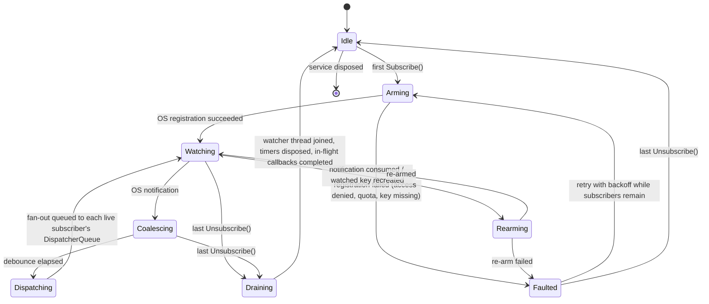

# Multi-Instance and Multi-Window Support

## Table of Contents

- [Overview](#overview)
- [Current State: One Window](#current-state-one-window)
- [Technical Obstacles](#technical-obstacles)
  - [1. Machine-global state with snapshot-based writers](#1-machine-global-state-with-snapshot-based-writers)
  - [2. Window singletons in the shell](#2-window-singletons-in-the-shell)
  - [3. The listener state machine](#3-the-listener-state-machine)
  - [4. Shared per-user files](#4-shared-per-user-files)
  - [5. The elevation boundary](#5-the-elevation-boundary)
- [Roadmap](#roadmap)
- [Guidance for New Code](#guidance-for-new-code)
- [References](#references)

## Overview

OneMMC is planned to support multiple windows — for example opening a snap-in in its own window, or
comparing two event logs side by side. It does not yet, and until it does, the application is limited
to **one window**: a second launch re-activates the existing window instead of opening another.

The limit exists because multiple windows cannot be supported correctly by simply allowing them. The
shell is built on single-window assumptions, OneMMC edits live machine-wide state rather than
independent documents, and keeping several views of that state consistent requires a coordinated
listener layer with an explicit state machine. This document describes those obstacles and the
staged plan to remove them.

## Current State: One Window

The restriction is implemented entirely in `src/OneMMC/Program.cs`, which replaces the
XAML-generated `Main` (`DISABLE_XAML_GENERATED_MAIN` in `OneMMC.csproj`):

1. Before `Application.Start`, the process claims the key `OneMMC.MainWindow` with the Windows App SDK
   `AppInstance.FindOrRegisterForKey`.
2. If another process already holds the key, the new process calls `AllowSetForegroundWindow` for it,
   redirects its activation with `RedirectActivationToAsync` (on a worker thread while the STA waits
   with `CoWaitForMultipleObjects`, per Microsoft's guidance), and exits without creating any XAML,
   DI container, or log file.
3. The running process receives `AppInstance.Activated`, restores its window if minimized, and
   activates it.
4. Any failure (registry unavailable, redirect error, 5-second timeout) fails open: the process starts
   normally rather than doing nothing.

"Run as administrator" (`AdminDialogHelper.RunasAdmin`) releases the key before starting the elevated
process and re-claims it if the restart did not happen (UAC declined). Otherwise the elevated process
would redirect back to the exiting one and no window would remain.

Inside the process there is one `MainWindow`; secondary UI is a `ContentDialog` or an owned
`ModalDialogWindow`.

## Technical Obstacles

### 1. Machine-global state with snapshot-based writers

Multi-window editors usually give each window its own document. OneMMC has no documents: every
snap-in is a view over one live machine state (Group Policy `Registry.pol` + `gpt.ini`, Windows
Firewall policy stores, Task Scheduler, Service Control Manager, SAM accounts, disk layout,
certificate stores, AzMan, the COM+ catalog, printers).

Most services follow a **load snapshot → edit → write back** flow with no version check, because with
one window there is no concurrent writer inside OneMMC:

- `LocalPolicyFileStore.SaveSnapshot` rewrites the whole `Registry.pol` and bumps the `gpt.ini`
  version. Two windows that each load, edit a different policy, and save produce a *lost update*: the
  second save discards the first edit.
- The Group Policy and Security Policy editors keep parsed state for the page's lifetime. A second
  window never learns about the first window's commit, so it shows — and can re-save — stale values.
- Disk Management performs destructive operations. Two views disagreeing about the disk layout is a
  correctness risk, not a cosmetic one.

Multi-window therefore first needs **optimistic concurrency** (a version captured at load and checked
before every write) and conflict UI in every editor.

### 2. Window singletons in the shell

The single-window assumption is spread across the UI layer rather than isolated behind an abstraction:

| Global | Location | What breaks with a second window |
|---|---|---|
| `App.MainWindowInstance` | `App.xaml.cs` | Referenced from ~47 files. About 45 pages and dialogs use it as the **owner HWND** for file pickers, native dialogs (CryptUI, ACL editor, object picker), and `ModalDialogWindow`. A dialog opened from window B would be owned by — and disable — window A. |
| `BreadcrumbNavigationService` | `Services/BreadcrumbNavigationService.cs` | A fully **static** navigation state machine (`Idle` / `NavigatingFromBreadcrumb` / `RestoringState` / `NavigatingForward`) bound by `Init(...)` to one `NavigationView`, `BreadcrumbBar`, and `Frame`. A second window would re-`Init` it and take over the first window's breadcrumbs and history stacks. |
| `App.ThemeChanged` / `App.CurrentTheme` | `App.xaml.cs` | Static event subscribed from ~51 files; `SetAppTheme` only re-themes `MainWindowInstance.Content`. Other windows would not follow theme changes. |
| `App.ShowErrorDialog` | `App.xaml.cs` | Always shows unhandled-exception dialogs in the main window's `XamlRoot`, whichever window failed. |
| `AdminDialogHelper._isDialogOpen`, `App._isErrorDialogShowing` | UI helpers | Static "one dialog at a time" guards: a dialog in window A suppresses the dialog in window B. |
| `PerformanceCounterInfo.InitializeDispatcher` | Core, PerfMon | Static UI dispatcher captured from the first window's thread. |
| `NavigationService` reclamation | `Services/NavigationService.cs` | One static reclamation token for post-navigation GC and `EmptyWorkingSet` (`doc/MemoryManagement.md`); it assumes a single navigation stream. |

### 3. The listener state machine

This is the largest obstacle. Several views stay live by listening to the OS:

| Listener | Lifetime today | Delivery |
|---|---|---|
| `WindowsFirewallRuleChangeService` | DI singleton; ref-counted `Subscribe()` returning `IDisposable`; first subscriber arms `RegNotifyChangeKeyValue` on a watcher thread, last one disarms it | 750 ms debounce on a thread-pool timer; each page marshals to its own `DispatcherQueue` |
| `EventViewerService` | Transient; one `EventLogWatcher` per instance | `EventRecordWritten` on a thread-pool thread |
| Page `DispatcherQueueTimer`s (Shared Folders, DTC statistics/transactions, firewall pages, task properties) | Page-owned, stopped at page teardown | Polling on the page's UI thread |
| `PerformanceCounterInfo` | Static dispatcher | PDH samples marshaled to the captured UI thread |

With one window, each listener has a single consumer chain (page → window → UI thread) and page
teardown (`PageServiceScope`) is the only lifecycle event that matters.

With several windows, each listener becomes a shared resource whose consumers live in windows with
independent lifetimes and possibly different UI threads. A correct implementation needs an explicit
state machine per listener:

Its transitions must also stay correct under concurrency that a single window never produces:

- **Per-subscriber dispatch.** Each subscription captures the `DispatcherQueue` of the window that
  created it, and a notification is fanned out as one enqueue per subscriber. A failed enqueue (the
  window's queue is already shut down) must drop that subscriber instead of throwing on the watcher
  thread.
- **Unsubscribe during dispatch.** A window closing while a fan-out is in flight must not receive a
  callback after its page scope is disposed. Removing it from the subscriber list is not enough; the
  queued callback needs a generation (epoch) check.
- **Ref-count races.** `Subscribe` from window B while window A's `Unsubscribe` is moving the listener
  to `Draining` must either cancel the drain or wait for `Idle` and re-arm — never leave a subscriber
  attached to a disarmed listener.
- **Visibility-aware suspension.** Minimized or background windows should stop polling and refresh
  once on reactivation, which adds per-subscriber `Suspended` states and a "dirty since suspend" flag.
- **Echo suppression.** When window A commits a firewall rule, the notification reaches both windows.
  A must not throw away its own selection and edit state by reloading in response to its own write; B
  must reload. That requires write tokens or version stamps carried from the writer to the listener.
- **Stores without OS notifications.** Task Scheduler, SAM, AzMan, `Registry.pol`, the COM+ catalog,
  and the certificate stores have no change notification wired in today. Multi-window needs an
  in-process change bus so a commit in one window invalidates the others.
- **Caching singletons.** `AdmxBundleProvider`, `SecurityPolicyService`, `AzManService`, and the WF
  services cache parsed state. With concurrent readers they need explicit invalidation and
  thread-safe snapshot publication.
- **Shutdown ordering.** Closing one window must tear down only that window's subscriptions; closing
  the last window must drain every listener before the DI container disposes the watcher threads and
  timers.

Done ad hoc, each item is a source of use-after-dispose crashes, leaked native watcher threads,
duplicate refreshes, and stale views. Done properly it is a cross-cutting framework, which is why it
is planned as its own phase rather than added window by window.

### 4. Shared per-user files

Separate processes would share files written without cross-process coordination:

| File | Writer | Problem |
|---|---|---|
| `%LOCALAPPDATA%\OneMMC\Settings.json` | `AppSettings.Load()` → mutate → `Save()` (theme, welcome flag, window placement) | Read-modify-write race; the last window to close overwrites the others' placement and settings. `File.WriteAllText` is not atomic. |
| `%LOCALAPPDATA%\OneMMC\Logs\OneMMC-<date>.log` | Serilog file sink, `shared: true` | Works, but interleaves records from several processes. |

This is one reason the roadmap keeps multiple windows **inside one process** rather than allowing
multiple processes.

### 5. The elevation boundary

OneMMC can run elevated or not (`doc/AdminDetectionSystem.md`). An elevated and a non-elevated window
side by side show different subsets of the same data and run listeners at different integrity
levels; users would edit in the wrong one. Elevation is therefore a *restart* of the window, not a
second window. Two cases are not handled yet:

- launching with "Run as administrator" from the shell while a non-elevated window is open redirects
  to the non-elevated window, and the elevation request is dropped;
- a non-elevated launch while an elevated window is open crosses an integrity boundary. Whether the
  Windows App SDK instance registry allows that redirect is not documented. If it does not, the
  fail-open path opens a second, non-elevated window. This case has not been verified yet.

## Roadmap

Each phase can ship on its own. Only phase 4 changes what users see; the one-window limit is lifted
once phases 1–3 are complete.

### Phase 1 — Window context instead of window globals

- Introduce a per-window `IWindowContext` (owner HWND, `XamlRoot`, `DispatcherQueue`, theme) and a
  per-window DI scope. Pages and dialogs resolve it from their own `XamlRoot` instead of
  `App.MainWindowInstance`.
- Migrate the ~45 `WindowNative.GetWindowHandle(App.MainWindowInstance)` call sites.
  `ModalDialogWindow` already accepts `OwnerXamlRoot`/`OwnerHwnd`, so this is mechanical.
- Make `BreadcrumbNavigationService` an instance owned by each window, keeping its state machine
  (`doc/Breadcrumb.md`).
- Move `App.ThemeChanged` to an instance event on `IThemeService` and apply theme changes to every
  window.
- Make the dialog guards and the unhandled-exception dialog per window.

Exit criterion: only `App` reads `App.MainWindowInstance`.

### Phase 2 — Listener infrastructure

- Generalize `WindowsFirewallRuleChangeService` into a reusable `SystemChangeSource<T>` that
  implements the [state machine above](#3-the-listener-state-machine): ref-counted arming,
  per-subscriber dispatcher capture, epoch-checked fan-out, fault and re-arm with backoff, drain on
  the last unsubscribe, deterministic disposal.
- Move `EventLogWatcher` usage and page polling timers onto it, with visibility-aware suspension.

Exit criterion: no page creates an OS listener or polling timer directly.

### Phase 3 — Shared-state coordination

- An in-process change bus: each successful commit publishes a typed invalidation (store + scope).
- Optimistic concurrency for every snapshot writer: capture a version at load (content hash of
  `Registry.pol`, `gpt.ini` version, registry last-write time, object `LastModified`) and verify it
  before writing; show a conflict prompt instead of overwriting.
- Thread-safe snapshot publication in caching singletons.
- Atomic settings writes (temp file + replace) with per-window placement entries.

Exit criterion: two views of the same store can be committed in any order with no lost updates and no
stale display.

### Phase 4 — Multi-window UX

- "Open in new window" for a snap-in: a second window inside the same process with its own
  `IWindowContext`. The second-launch redirect in `Program.cs` stays; it changes from "activate the
  window" to "activate or open the window for the requested snap-in".
- Route future command-line or protocol activations naming a snap-in to the right window.
- Optional restore of open windows on startup.

### Phase 5 — Elevation-aware instancing

- When an elevated launch finds a non-elevated instance, send a *handoff request* rather than a plain
  activation: the running instance runs its unsaved-changes guard, releases the key, and exits, and
  the elevated process takes over. This needs a custom activation payload (for example a protocol
  activation such as `onemmc://handoff`), because plain launch arguments cannot express the intent.
- Verify cross-integrity redirection and settle the policy for the reverse case.

## Guidance for New Code

Until the roadmap is done:

- Do not create additional top-level application windows.
- Code that starts a replacement OneMMC process must call `Program.ReleaseInstanceKey()` first and
  `Program.ReclaimInstanceKey()` if the launch did not happen (see `AdminDialogHelper.RunasAdmin`).
- Write new listeners so they could serve several consumers: return an `IDisposable` subscription,
  capture the consumer's `DispatcherQueue` at subscribe time, and never call UI code from the OS
  notification thread (follow `WindowsFirewallRuleChangeService`). This keeps phase 2 incremental.
- Prefer resolving an owner HWND or `XamlRoot` from the calling page over adding new
  `App.MainWindowInstance` references.

## References

- [Create a single-instanced WinUI app with C#](https://learn.microsoft.com/windows/apps/windows-app-sdk/applifecycle/applifecycle-single-instance)
- [App instancing with the app lifecycle API](https://learn.microsoft.com/windows/apps/windows-app-sdk/applifecycle/applifecycle-instancing)
- [Multi-instance apps with Windows App SDK](https://learn.microsoft.com/windows/apps/develop/launch/multi-instance-apps)
- [`AllowSetForegroundWindow`](https://learn.microsoft.com/windows/win32/api/winuser/nf-winuser-allowsetforegroundwindow)
- `doc/AdminDetectionSystem.md`, `doc/Breadcrumb.md`, `doc/MemoryManagement.md`
