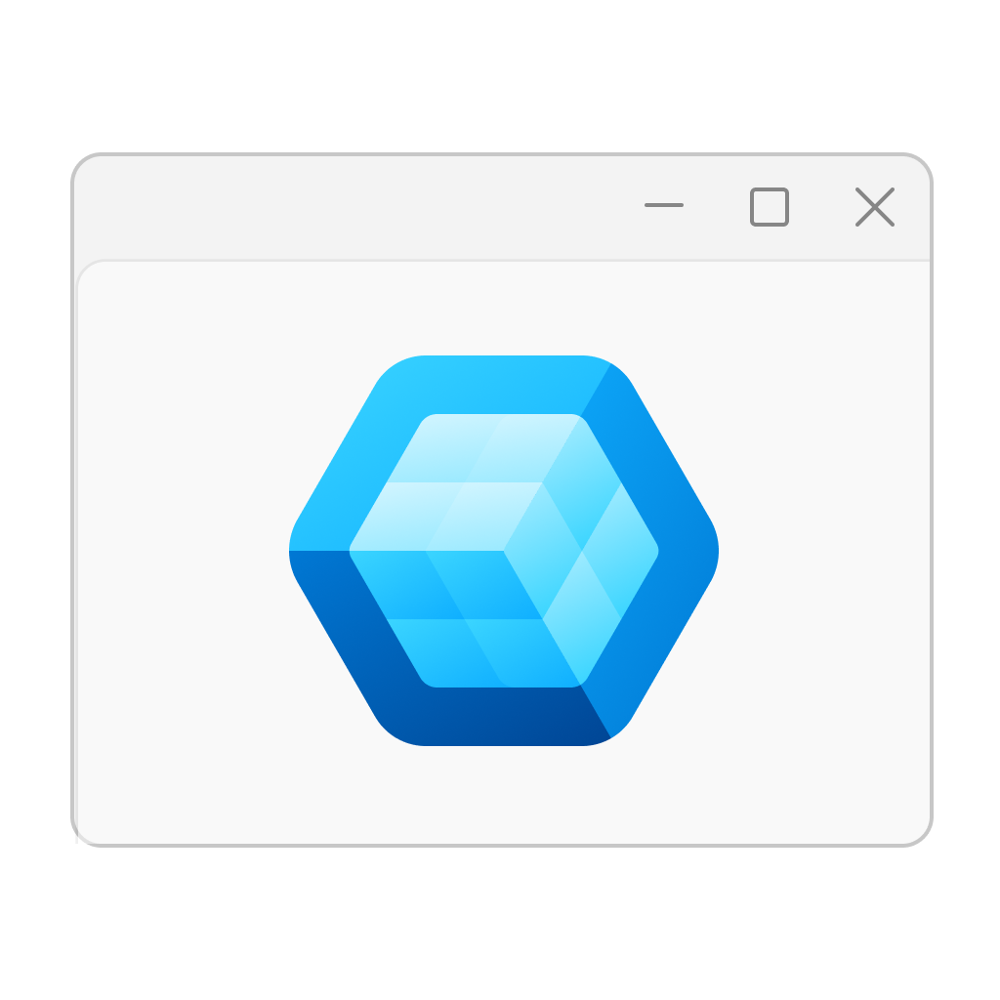

<div style="display: flex; align-items: center; justify-content: left;">
  <picture>
    
  </picture>
  <h1 style="margin-left: 16px;">
    <span>OneMMC.Core</span>
  </h1>
</div>

`OneMMC.Core` is the **Windows-native application layer** for OneMMC — the headless "engine" that
sits beneath the WinUI 3 shell. It owns every piece of logic that does *not* draw pixels: the
ViewModels the UI binds to, the services that talk to Windows, the domain models, and all the
COM / WMI / Win32 interop that makes management features work.

It is deliberately **not** a cross-platform Clean-Architecture sample. The goal is practical,
maintainable code with a hard UI/Core boundary, a predictable feature layout, and full
**Native AOT** compatibility.

> Dependency direction is one-way: **UI → Core only**. Core never references the `OneMMC` UI
> project.

---

## Table of Contents

- [Role in the Solution](#role-in-the-solution)
- [Technology Stack](#technology-stack)
- [Top-Level Layout](#top-level-layout)
- [Feature Catalogue](#feature-catalogue)
- [Anatomy of a Feature](#anatomy-of-a-feature)
- [Dependency Injection](#dependency-injection)
- [Native Interop Deep Dive](#native-interop-deep-dive)
- [Native AOT Constraints](#native-aot-constraints)
- [Shared Infrastructure](#shared-infrastructure)
- [Localization](#localization)
- [Architecture Rules (Normative)](#architecture-rules-normative)
- [Adding or Changing a Feature](#adding-or-changing-a-feature)
- [Debugging Guide](#debugging-guide)
- [Anti-Patterns](#anti-patterns)

---

## Role in the Solution

OneMMC is split into two projects:

| Project | Type | Responsibility |
|---|---|---|
| **OneMMC** | WinUI 3 `WinExe` | XAML views, converters, app shell, navigation, theming, DI bootstrap |
| **OneMMC.Core** | Class library | ViewModels, services, models, and all Windows-native interop |

Everything in Core is **UI-neutral**: it exposes state through observable properties and commands,
and lets the View decide how to present it. This is what allows the same service/ViewModel to be
driven from a page, a dialog, or a smoke test without dragging in the visual tree.

> **~264 C# files**, organized into 6 feature areas and a shared infrastructure spine.

---

## Technology Stack

| Concern | Technology |
|---|---|
| Target framework | `net10.0-windows10.0.19041.0` (min OS `10.0.19041.0`) |
| Language | C# `preview` (`LangVersion=preview`), nullable enabled, implicit usings |
| Deployment model | **Native AOT** (`PublishAot` unconditional — see [`doc/NativeAot.md`](../../doc/NativeAot.md)) |
| MVVM | `CommunityToolkit.Mvvm` 8.4.2 (`ObservableObject`, `[ObservableProperty]`, `[RelayCommand]`) |
| DI | `Microsoft.Extensions.DependencyInjection` |
| Logging | `Microsoft.Extensions.Logging` + Serilog |
| Win32 interop | **CsWin32** source generator (`Windows.Win32.PInvoke`, driven by `NativeMethods.txt`) |
| COM interop | Source-generated `[GeneratedComInterface]` + `ComWrappers` (no `[ComImport]`, no `dynamic`) |
| WMI / CIM | **WmiLight** for queries/methods/events; in-house marshal-free `IWbemServices` wrapper for instance CRUD |
| Directory / accounts | **ADSI** + **NetAPI32** via CsWin32 (no `System.DirectoryServices*`) |
| Performance counters | **PDH** via CsWin32 (no `System.Diagnostics.PerformanceCounter`) |
| Platform APIs | `Microsoft.WindowsAppSDK` / `Microsoft.UI.*` — **only** for reusable native services (pickers, dialogs, image helpers) |

The `Microsoft.WindowsAppSDK` reference is intentional and bounded: Core may call platform APIs
for OS-integration helpers (file/folder pickers, native dialogs, ACL/icon pickers), but it must
never reference WinUI *presentation* types (`Page`, `Window`, `FrameworkElement`, `ContentDialog`, …).

---

## Top-Level Layout

Only these five top-level folders are valid. Do **not** reintroduce a top-level `Services` folder.

```
OneMMC.Core/
├── Abstractions/          Cross-feature contracts (interfaces only)
│   └── Services/          IAdminService, IFileDialogService, ILocalizationProvider, INavigationService
├── DependencyInjection/   AddOneMMCCore() — the single Core DI entry point
├── Features/              Feature-first buckets (the bulk of the code)
├── Infrastructure/        Shared native/OS integration used by more than one feature
│   ├── Admin/             AdminService (elevation / permission detection)
│   ├── Interop/           ComActivator, IDispatch base, Variant helpers, ADSI layer
│   ├── PolicyStorage/     Registry.pol snapshot types + policy file persistence
│   ├── WindowsCapabilities/ AppSdkFileDialogService, AclEditorService, object/CA/icon pickers
│   └── Wmi/               WmiLight helper extensions (disposal, property, DMTF date conversion)
└── Localization/          LocalizationProvider (static) + ResourceKeys constants
```

**Namespace rule:** the namespace always matches the real folder path. No mirror namespaces, no
compatibility/wrapper namespaces, no `OneMMC.Core.Services.*`-style flat namespaces.

---

## Feature Catalogue

Features are grouped by management domain under `Features/`. Each is a self-contained slice; a
feature must **never** reference types from another feature — share only through `Abstractions`.

| Feature area | Sub-tools | Primary interop |
|---|---|---|
| **PCManagement** | Device Manager (`DevMgmt`), Disk Management (`DiskMgmt`), Event Viewer, Shared Folders (`FsMgmt`), Local Users & Groups (`LusrMgr`), Performance Monitor (`PerfMon`), Task Scheduler (`TaskSchd`), Windows Services | SetupAPI, VirtDisk, WmiLight, PDH, Task Scheduler COM, `ServiceController` |
| **PolicyManagement** | Group Policy Editor (`GpEdit`), Resultant Set of Policy (`RSoP`) | `IGroupPolicyObject` COM, `Registry.pol` |
| **UserSecurity** | Authorization Manager (`AzMan`), Local Security Policy (`SecPol`), Network List Manager | AzRoles COM, LSA/NetAPI32, ADSI |
| **SystemManagement** | Component Services / COM+ (`ComExp`), Windows Firewall (`WF`), TPM | COM+ Admin COM, marshal-free `IWbemServices`, HNetCfg |
| **Certificates** | Certificate stores (CertMgr / CertLM) | CryptoAPI / CertEnroll |
| **PrintManagement** | Printers & print queues | Winspool / print WMI |

The `Native/` interop lives *inside* each feature's `Interop` bucket (e.g.
`TaskSchd/Native/TaskSchedulerNative.cs`), keeping the ABI contract next to its only consumer.
There are **~17 native interop files** across the codebase.

---

## Anatomy of a Feature

Use feature-first folders under `Features/<FeatureName>/`. Allowed first-level buckets — create
only the ones a feature actually needs:

| Bucket | Responsibility |
|---|---|
| `Models` | Feature DTOs, state objects, bindable data models |
| `Services` | Orchestration, queries, operations, business logic |
| `ViewModels` | UI-facing state + command orchestration (bound by the View) |
| `Infrastructure` | Feature-local storage, filesystem, registry, or OS integration |
| `Interop` | COM interfaces, P/Invoke structs, constants, native wrappers |
| `Utilities` | **Stateless** helpers, extensions, formatters, pure conversions |

`Utilities` must stay stateless — no orchestration, persistence, DI, or native ownership there.

Do **not** create feature buckets called `Common`, `Native`, `Support`, or `Helpers`. (`Native` is
allowed as a *sub*-folder inside `Interop`/`Services`, not as a first-level bucket.)

Each feature ships an internal `<FeatureName>Module.cs` that registers its services and ViewModels:

```csharp
internal static class PCManagementModule
{
    internal static IServiceCollection AddPCManagement(this IServiceCollection services)
    {
        services.AddTransient<DiskManagementService>();
        // Task Scheduler holds a dedicated STA COM thread + cached connection → singleton.
        services.AddSingleton<ITaskSchedulerService, TaskSchedulerService>();
        services.AddTransient<DiskManagementViewModel>();
        // ...
        return services;
    }
}
```

Lifetime choice is deliberate: most services/ViewModels are **transient**; anything that owns a
persistent native resource (an STA COM apartment thread, a cached connection) is a **singleton**.

---

## Dependency Injection

- The **only** Core DI entry point is `AddOneMMCCore(this IServiceCollection services)` in
  `DependencyInjection/ServiceCollectionExtensions.cs`.
- Registration is **explicit and reflection-free** — no assembly scanning, no convention-based
  auto-registration. (This is a hard AOT/trim requirement, not a style choice.)
- Feature modules stay `internal` and are called from `AddOneMMCCore`.

```csharp
public static IServiceCollection AddOneMMCCore(this IServiceCollection services)
{
    services.AddSingleton<AdminService>();
    services.AddSingleton<IAdminService>(sp => sp.GetRequiredService<AdminService>());
    services.AddSingleton<IFileDialogService, AppSdkFileDialogService>();
    // ... other shared infrastructure ...

    services.AddCertificates();
    services.AddPCManagement();
    services.AddPolicyManagement();
    services.AddPrintManagement();
    services.AddSystemManagement();
    services.AddUserSecurity();
    return services;
}
```

The UI project chains this from its own `AddOneMMCApplicationServices()`, which then adds the
UI-only services (theme, navigation, breadcrumb). See the UI project's README for that half.

**Rules:** no runtime service locators, no parameterless fallback constructors, no direct
service instantiation bypasses for normal flow. If a type needs a dependency, inject it.

---

## Native Interop Deep Dive

Because Native AOT has **no fallback RCW/CCW COM behavior** to paper over layout or activation
mistakes at runtime, all interop is compile-time explicit. Get the ABI wrong and the failure is
immediate — sometimes catastrophic.

### CsWin32 (default for Win32)

When a Win32 API exists in CsWin32 metadata, add the export/interface name to `NativeMethods.txt`
and call the generated `Windows.Win32.PInvoke.*` member. **Do not** hand-write a new `[DllImport]`
/ `[LibraryImport]`. The Core `NativeMethods.txt` already declares SetupAPI, VirtDisk, LSA audit,
service control, ADSI, printing, and dozens more.

> Handwritten interop is a **documented exception only** — for unsupported exports, APIs CsWin32
> can't emit for the active architecture, unavoidable BCL/COM marshalling gaps, or mixed native
> workflows. Any remaining handwritten import must live in a dedicated wrapper file with a comment
> explaining why CsWin32 couldn't be used. For a single missing export, prefer `NativeLibrary` +
> delegate binding over a new static import.

### COM (source-generated)

1. Prefer CsWin32 for metadata-backed COM types.
2. For custom/dual interfaces, declare `[GeneratedComInterface]` with **exact** member order.
3. Derive from `Infrastructure/Interop/IDispatch.cs` only when the interface is truly *dual*
   (`IUnknown[3] + IDispatch[4] + members` vtable layout).
4. Activate coclasses through `Infrastructure/Interop/ComActivator.cs`
   (`CLSIDFromProgID` + `CoCreateInstance`, wrapped with `ComWrappers`).
5. Keep ABI details explicit: `get_`/`put_` accessors, raw `short` for `VARIANT_BOOL`, explicit
   optional `VARIANT` args, placeholder members to preserve slot order.

Reference ports to copy from: `AzMan/Native/AzRolesNative.cs` (large dual interface),
`ComExp/Native/ComAdminNative.cs`, `TaskSchd/Native/TaskSchedulerNative.cs`,
`GpEdit/Native/NativeMethods.cs` (non-dual).

### WMI / CIM

Two sanctioned paths, chosen by capability:

- **WmiLight** — the *default* for queries, method calls, and event subscriptions. Shared helpers
  (disposal, property extraction, DMTF↔`DateTime`) live in `Infrastructure/Wmi/`.
- **Marshal-free `IWbemServices` wrapper** — for WMI **instance create/modify/delete** that
  WmiLight cannot represent (e.g. Windows Firewall rule writes). Reference implementation:
  `Features/SystemManagement/Infrastructure/WF/Wbem/`.

Dispose behavior is part of correctness here — the underlying handles are native.

**Do not use polled intrinsic events (`__InstanceOperationEvent … WITHIN n`) over large classes.**
To diff such a query WMI caches a full instance snapshot of the watched class, charged against the
per-user `__ArbitratorConfiguration.PollingMemoryPerUser` quota (5 MB by default). A single
`MSFT_NetFirewallRule` subscription already approaches that quota on a machine with ~500 rules, so
registration fails nondeterministically with `WBEM_E_QUOTA_VIOLATION` (0x8004106C); neither a longer
`WITHIN` interval nor merging the classes into one `OR`'d query reduces the cost, because it tracks
snapshot size rather than frequency. Prefer a cheaper change signal — `WindowsFirewallRuleChangeService`
watches the firewall policy registry subtree with `RegNotifyChangeKeyValue` instead.

### Directory / accounts & performance counters

- Local users/groups → **NetAPI32**; LDAP/ADSI object access → the in-house ADSI layer at
  `Infrastructure/Interop/Adsi/`.
- Performance counters → **PDH** (`PerfMon/`), using `PdhAddEnglishCounterW` where localized
  counter names differ.

---

## Native AOT Constraints

These are **normative** for all new/modified code. The AOT/trim/single-file analyzers run on every
build (`Directory.Build.props`), so violations surface as warnings, not runtime crashes.

| Do not add | Use instead |
|---|---|
| `dynamic` over COM | Typed `[GeneratedComInterface]` + `ComWrappers` |
| `Type.GetTypeFromProgID`/`GetTypeFromCLSID` + `Activator.CreateInstance` | `CoCreateInstance` via `ComActivator` |
| New `[ComImport]` interfaces | `[GeneratedComInterface]` |
| `System.Management` / `Microsoft.Management.Infrastructure` | WmiLight or the `IWbemServices` wrapper |
| `System.DirectoryServices*` | NetAPI32 + ADSI via CsWin32 |
| `System.Diagnostics.PerformanceCounter` | PDH via CsWin32 |
| Reflection-based `JsonSerializer` overloads | Source-generated `JsonSerializerContext` |
| `[ObservableProperty]` on **fields** | `[ObservableProperty]` on **partial properties** (fixes MVVMTK0045) |
| Non-`partial` WinRT ABI-facing classes | `partial` classes (fixes CsWinRT1028/1029) |
| Reflection activation / `MakeGenericType` / `Reflection.Emit` | Explicit DI registration, compile-time-known types |

> **Never propose abandoning or scaling back AOT** because of a limitation — propose the
> AOT-compatible alternative instead. The single reference for verified state, measured baseline,
> and migration history is [`doc/NativeAot.md`](../../doc/NativeAot.md).

---

## Shared Infrastructure

Cross-feature sharing goes **only** through `Abstractions`, `Infrastructure`, or an explicitly
documented shared contract. Current shared areas:

- `Infrastructure/WindowsCapabilities` — `AppSdkFileDialogService`, `AclEditorService`,
  `DirectoryObjectPickerService`, `CertificateAuthorityPickerService`, `IconPickerService`
- `Infrastructure/PolicyStorage` — raw `Registry.pol` snapshot types, registry-backed policy
  proxy, and local policy-file persistence used outside `PolicyManagement`
- `Infrastructure/Interop` — `ComActivator`, the `IDispatch` dual-interface base, `Variant`
  helpers, and the ADSI layer
- `Infrastructure/Wmi` — WmiLight disposal/property/date-conversion helpers
- `Infrastructure/Admin` — `AdminService` (elevation state + `IsPermissionError` detection)

Keep Windows-native capability code here instead of scattering it across features. Promote code to
`Infrastructure` only when **two** features genuinely need it — not preemptively.

---

## Localization

- Two locales: **en-US** and **zh-TW**. Resource strings live in the UI project's
  `Strings/{locale}/*.resw`; Core references them through keys.
- Core exposes strings via `LocalizationProvider.Current` (the **only** sanctioned static access
  point at the architecture level) and the `ResourceKeys` constants in `Localization/`.
- **No hardcoded user-facing strings** in ViewModels — every visible string comes from a
  `ResourceKeys` constant resolved through `ILocalizationProvider`.

---

## Architecture Rules (Normative)

1. **UI/Core boundary** — Core may use Win32/COM/WinRT/P-Invoke/WinAppSDK capability APIs, but must
   not depend on WinUI presentation types (`Page`, `UserControl`, `Window`, `FrameworkElement`,
   `ContentDialog`, `NavigationViewItem`, visual-tree manipulation). If a workflow needs HWND
   ownership or `BitmapImage`, keep that boundary in the UI project and feed Core UI-neutral data.
2. **ViewModels never touch UI** — no `DispatcherQueue`, `XamlRoot`, `ElementTheme`, controls, or
   presentation state. Expose observable properties; let the View present them.
3. **Features never cross-reference** — share only through `Abstractions`.
4. **No direct `new` on Infrastructure** from features — depend on `Abstractions` interfaces,
   resolve via DI.
5. **Async `[RelayCommand]` returns `Task`**, never `async void` (MVVMTK0039).
6. **Namespace = folder path**, always.

---

## Adding or Changing a Feature

1. Put the code under the owning feature first (`Features/<FeatureName>/`).
2. Create only the buckets the feature needs; keep namespace and folder path aligned from the start.
3. Register services/ViewModels explicitly in the feature's `<FeatureName>Module.cs`.
4. Move code to shared `Infrastructure` **only** when a second feature genuinely needs it.
5. Follow the [Native AOT constraints](#native-aot-constraints) for any interop.
6. Update this README (or the feature's own notes) if a boundary or folder intent changes.

---

## Debugging Guide

**Build (normal CoreCLR inner loop — F5 / `dotnet build`):**

```bash
dotnet build src/OneMMC/OneMMC.csproj -c Debug -p:Platform=x64
```

Building the `.csproj` directly with no `-p:Platform` evaluates the library as AnyCPU; the csproj
falls back to `PlatformTarget=x64` so CsWin32 can emit x64 P/Invokes (otherwise SetupAPI interop in
`DeviceManagerService` fails with PInvoke005). Prefer a solution/platform build.

**Verify AOT compatibility (analyzers run on the normal build):**

```bash
dotnet build src/OneMMC/OneMMC.csproj -c Release -p:Platform=x64   # expect 0 new IL2xxx/IL3xxx/CsWinRT1xxx/MVVMTK0045
dotnet publish src/OneMMC/OneMMC.csproj -c Release -r win-x64      # actual native codegen (needs MSVC toolchain)
```

`dotnet build` never produces native code — only `dotnet publish` runs ILC. But the analyzers fire
on *every* build, so most AOT regressions are caught while coding, not at publish time.

**Logs:** daily rolling files at `%LOCALAPPDATA%\OneMMC\Logs\`. Inject `ILogger<T>` via the
constructor in services/ViewModels; `Microsoft`/`System` categories are filtered to Warning.
Never use `Debug.WriteLine`, `Console.WriteLine`, or `Trace.WriteLine` directly. A clean AOT run
leaves the log free of `[ERR]`/`[FTL]` and unexpected exceptions.

**Interop failures:** a wrong COM vtable slot or missing `[GeneratedComInterface]` member typically
manifests as an `AccessViolation` or `InvalidCastException` at the *first* call, not at activation.
Cross-check the member order and `get_`/`put_` accessors against the type library before assuming a
logic bug. Compare against the reference ports listed in [Native Interop Deep Dive](#native-interop-deep-dive).

**Admin/permission handling:** use `IAdminService.IsRunningAsAdmin` (pre-flight),
`IAdminService.IsPermissionError(ex)` (detection), or `OperationResult.AccessDenied()`
(disk operations). See [`doc/AdminDetectionSystem.md`](../../doc/AdminDetectionSystem.md).

---

## Anti-Patterns

Avoid these in Core:

- interface explosion / artificial platform abstraction
- mediator / event-bus / CQRS / repository scaffolding
- direct feature-to-feature implementation references
- fallback constructors that hide missing DI wiring
- reflection-driven registration or service location
- mirror / compatibility / wrapper / type-alias transition namespaces
